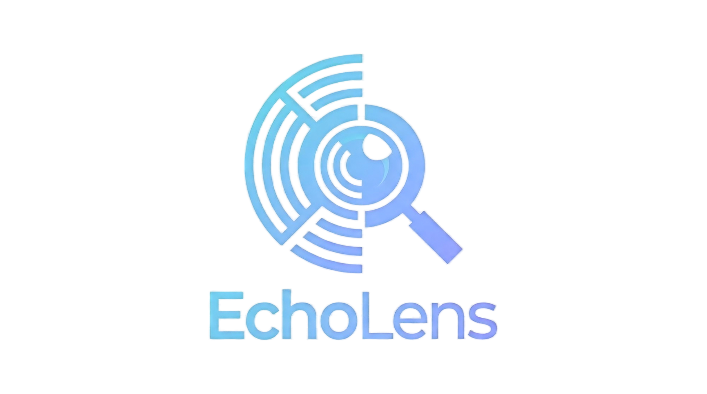

# EchoLens

<div align="center">



**E-commerce Public Opinion Simulation Engine | 三创赛 Entry**

*电商舆情仿真引擎*

[](./LICENSE)
[](./package.json)
[](./backend/pyproject.toml)

[English](./README-EN.md) | [中文文档](./README.md)

</div>

---

## ⚡ Project Overview

**EchoLens** is an AI-powered public opinion simulation engine for e-commerce scenarios. Upload marketing plans, product documents, or market reports, and the system automatically constructs a parallel social media world with **millions of Agents**, simulating consumer reactions, information propagation, and opinion evolution.

> **You only need to**: Upload e-commerce documents (PDF/MD/TXT) and describe your simulation needs in natural language  
> **EchoLens returns**: A detailed opinion analysis report and an interactive simulation world

### Core Values

- 🎯 **Opinion Preview**: Predict consumer reactions before product launch
- 🔍 **Risk Detection**: Identify potential PR risks in marketing campaigns
- 📊 **Propagation Analysis**: Track information spread across social networks
- 💬 **Deep Interaction**: Chat with any Agent in the simulation world

---

## 🔄 Workflow

```
┌─────────────┐    ┌─────────────┐    ┌─────────────┐    ┌─────────────┐
│  Graph      │ → │ Agent       │ → │ Opinion     │ → │ Report      │
│  Building   │    │ Generation  │    │ Simulation  │    │ Generation  │
│             │    │             │    │             │    │             │
│ Extract     │    │ Consumer    │    │ Weibo/      │    │ Analysis &  │
│ Entities    │    │ Personas    │    │ Xiaohongshu │    │ Propagation │
└─────────────┘    └─────────────┘    └─────────────┘    └─────────────┘
```

1. **Graph Building**: Extract entities and relationships from documents, build knowledge graph
2. **Agent Generation**: Generate Agents with independent personalities and memories
3. **Opinion Simulation**: Parallel simulation on Weibo/Xiaohongshu platforms
4. **Report Generation**: ReportAgent analyzes results and generates reports
5. **Deep Interaction**: Chat with Agents or ReportAgent

---

## 🔗 EchoLens Insight Integration (Optional)

**EchoLens Insight** (based on [EchoLens-Insight](https://github.com/666ghj/EchoLens-Insight)) is an optional upstream module that automatically collects and analyzes real public opinion data. The generated report can be used as input for EchoLens simulation.

### Integration Flow

```
┌──────────────────────────────────────────────────────────────────────────┐
│                       EchoLens Insight (Optional)                           │
│  ┌─────────────┐    ┌─────────────┐    ┌─────────────┐                  │
│  │ Opinion     │ → │ Multi-Agent │ → │ Report      │                  │
│  │ Collection  │    │ Analysis    │    │ Generation  │                  │
│  └─────────────┘    └─────────────┘    └─────────────┘                  │
└──────────────────────────────────────┬───────────────────────────────────┘
                                       │
                                       ▼ Export as seed document
┌──────────────────────────────────────────────────────────────────────────┐
│                          EchoLens Main System                                │
│  ┌─────────────┐    ┌─────────────┐    ┌─────────────┐    ┌───────────┐ │
│  │ Graph       │ → │ Agent       │ → │ Opinion     │ → │ Prediction│ │
│  │ Building    │    │ Generation  │    │ Simulation  │    │ Report    │ │
│  └─────────────┘    └─────────────┘    └─────────────┘    └───────────┘ │
└──────────────────────────────────────────────────────────────────────────┘
```

### Use Cases

| Scenario              | Document Source  | Description                                             |
| --------------------- | ---------------- | ------------------------------------------------------- |
| **Opinion-driven**    | EchoLens Insight | Collect real opinions → Analyze → Predict future trends |
| **Plan-driven**       | Self-prepared    | Upload marketing plans → Preview consumer reactions     |
| **Competitor-driven** | EchoLens Insight | Analyze competitor opinions → Simulate market response  |

---

## 🚀 Quick Start

### Prerequisites

| Tool        | Version | Description            |
| ----------- | ------- | ---------------------- |
| **Node.js** | 18+     | Frontend runtime       |
| **Python**  | ≥3.11   | Backend runtime        |
| **uv**      | Latest  | Python package manager |

### 1. Configure Environment

```powershell
Copy-Item ".env.example" ".env"
```

Edit `.env` with required API keys:

```env
# LLM API (OpenAI SDK compatible)
LLM_API_KEY=your_api_key
LLM_BASE_URL=https://dashscope.aliyuncs.com/compatible-mode/v1
LLM_MODEL_NAME=qwen-plus

# Zep Cloud (Knowledge Graph)
ZEP_API_KEY=your_zep_api_key
```

### 2. Install Dependencies

```powershell
npm run setup:all
```

### 3. Start Services

```powershell
# Recommended: Interactive script
./tools/run_all.ps1

# Or direct start
npm run dev
```

### Endpoints

| Service     | URL                     |
| ----------- | ----------------------- |
| Frontend    | `http://localhost:3000` |
| Backend API | `http://localhost:5001` |

---

## 🏗️ Architecture

```
EchoLens/
├── frontend/                 # Vue3 Frontend
│   ├── src/views/           # Page components
│   └── src/api/             # API calls
├── backend/                  # Flask Backend
│   ├── app/api/             # API routes
│   ├── app/services/        # Core services
│   │   ├── ontology_generator.py    # Ontology generation
│   │   ├── graph_builder.py         # Graph building
│   │   ├── oasis_profile_generator.py # Agent generation
│   │   ├── simulation_runner.py     # Simulation runner
│   │   └── report_agent.py          # Report generation
│   └── scripts/             # Simulation scripts
├── third_party/
│   └── EchoLens-Insight/           # EchoLens Insight (optional)
└── tools/
    └── run_all.ps1          # Interactive launcher
```

---

## 📡 Key APIs

### Graph Management

| Endpoint                | Method | Description                        |
| ----------------------- | ------ | ---------------------------------- |
| `/api/graph/ontology`   | POST   | Upload files and generate ontology |
| `/api/graph/build`      | POST   | Build knowledge graph              |
| `/api/graph/{graph_id}` | GET    | Get graph data                     |

### Simulation Management

| Endpoint                      | Method | Description                    |
| ----------------------------- | ------ | ------------------------------ |
| `/api/simulation/create`      | POST   | Create simulation              |
| `/api/simulation/prepare`     | POST   | Prepare simulation environment |
| `/api/simulation/start`       | POST   | Start simulation               |
| `/api/simulation/{id}/status` | GET    | Query simulation status        |

### Report & Interaction

| Endpoint                | Method | Description              |
| ----------------------- | ------ | ------------------------ |
| `/api/report/generate`  | POST   | Generate analysis report |
| `/api/report/interview` | POST   | Chat with Agent          |

---

## 💡 Innovation / Creativity / Entrepreneurship

### 🚀 Innovation

| Point                                 | Description                                                                  |
| ------------------------------------- | ---------------------------------------------------------------------------- |
| **Document-driven Simulation**        | Only upload documents to build simulation world, no structured data required |
| **Knowledge Graph + Agent Fusion**    | Deep integration of Zep graph and LLM Agents                                 |
| **Dual-platform Parallel Simulation** | Simulate Twitter and Reddit simultaneously                                   |
| **Interactive Simulation World**      | Chat with any Agent after simulation                                         |
| **End-to-end Automation**             | Fully LLM-driven from graph building to report generation                    |

### 🎨 Creativity

| Point                           | Description                                             |
| ------------------------------- | ------------------------------------------------------- |
| **"E-commerce War Room"**       | Military sandbox simulation concept for e-commerce      |
| **Opinion "Time Machine"**      | Predict future opinion trends from current market       |
| **Consumer "Digital Twin"**     | Each Agent has unique personality, memory, and logic    |
| **Insight → EchoLens Pipeline** | Optional upstream collection + downstream prediction    |
| **"God View" Intervention**     | Inject variables during simulation to observe responses |

### 💼 Entrepreneurship

| Point                            | Description                                        |
| -------------------------------- | -------------------------------------------------- |
| **Marketing Preview Service**    | "Simulate before launch" SaaS for brands           |
| **PR Risk Early Warning**        | Predict risks before product/campaign launch       |
| **Competitor Response Analysis** | Simulate competitor actions impact on market       |
| **Consumer Insight Reports**     | Generate insights from simulation, replace surveys |
| **On-premise Deployment**        | Private deployment for data security compliance    |

---

## 🔗 Reference Projects

Built upon these open-source projects:

- **[EchoLens](https://github.com/666ghj/EchoLens)**: Swarm intelligence engine core
- **[EchoLens-Insight](https://github.com/666ghj/EchoLens-Insight)**: Opinion analysis engine (EchoLens Insight)

---

## 📬 Contact

Questions or suggestions? Submit an [Issue](https://github.com/zuohenlin/EchoLens/issues).

---

## 📄 Acknowledgments

- Thanks to [EchoLens](https://github.com/666ghj/EchoLens) team for the core framework
- Thanks to [Zep](https://www.getzep.com/) for knowledge graph services
- Thanks to the National College E-commerce "Innovation, Creativity & Entrepreneurship" Challenge (三创赛)

---

## 📈 Statistics

[](https://github.com/zuohenlin/EchoLens/stargazers)
[](https://github.com/zuohenlin/EchoLens/network)
[](https://github.com/zuohenlin/EchoLens/issues)
