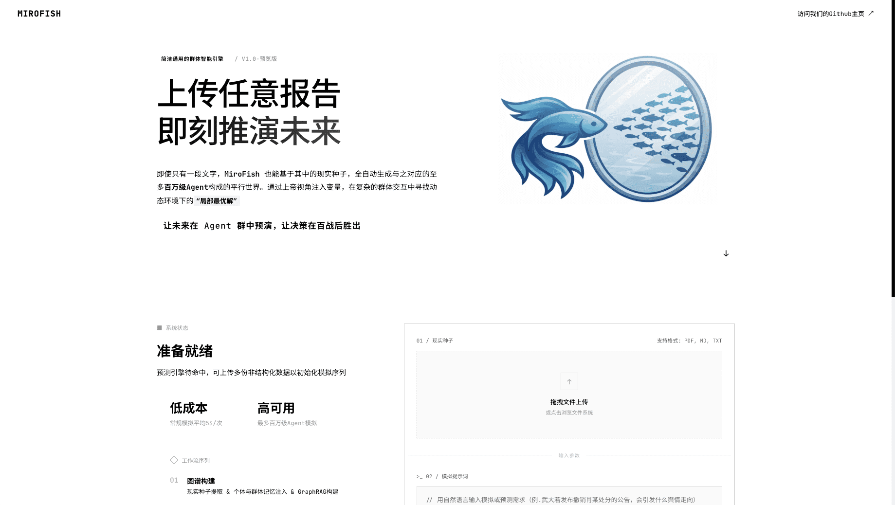
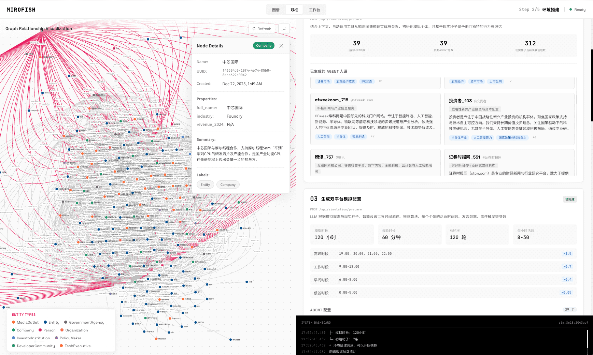
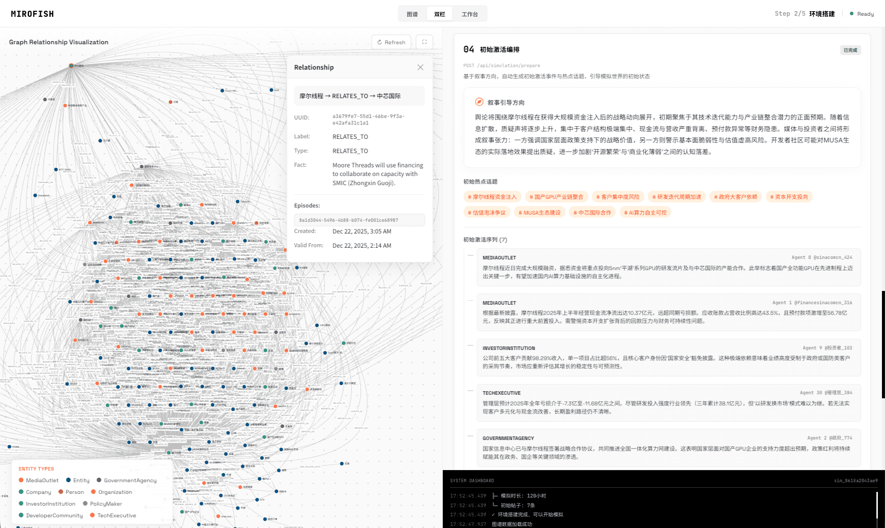
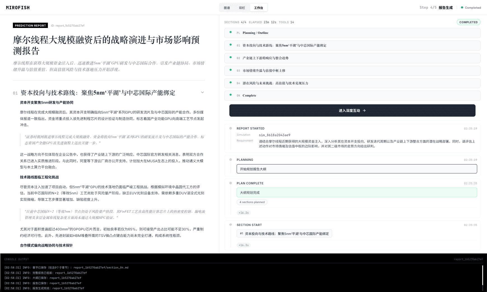

# EchoLens 回声透镜

<div align="center">


**回声透镜 | 电商舆情仿真引擎 | 三创赛作品**

*Hear the Echo, See the Future*

[](./LICENSE)
[](./package.json)
[](./backend/pyproject.toml)

[English](./README-EN.md) | [中文文档](./README.md)

</div>

---

## ⚡ 项目概述

**EchoLens 回声透镜** 是一款面向电商场景的 AI 舆情仿真引擎。名称寓意"透过回声洞察未来"——通过上传营销方案、产品文档或市场报告，系统自动构建由**百万级 Agent** 组成的社交媒体平行世界，模拟消费者对营销活动的反应、传播路径与舆论演化。

> **你只需**：上传电商相关文档（PDF/MD/TXT），用自然语言描述仿真需求  
> **回声透镜将返回**：一份详尽的舆情分析报告，以及一个可深度交互的仿真世界

### 核心价值

- 🎯 **舆情预演**：在产品发布前预测消费者反应，提前听见市场的"回声"
- 🔍 **风险识别**：像透镜一样透视营销方案的潜在舆情风险
- 📊 **传播分析**：追踪信息在社交网络中的传播路径
- 💬 **深度交互**：与仿真世界中的 Agent 进行对话，深入了解消费者心声

---

## 🔄 工作流程

```
┌──────────────┐     ┌──────────────┐     ┌──────────────┐     ┌──────────────┐
│   图谱构建   │ ──▶ │  Agent生成   │ ──▶ │   舆情模拟   │ ──▶ │   报告生成   │
│              │     │              │     │              │     │              │
│  提取实体 &  │     │  消费者画像  │     │   微博 /     │     │  舆情分析 &  │
│  构建本体    │     │  人设配置    │     │  小红书仿真  │     │  传播路径    │
└──────────────┘     └──────────────┘     └──────────────┘     └──────────────┘
```

1. **图谱构建**：从文档中提取实体与关系，构建知识图谱
2. **Agent 生成**：基于图谱生成具有独立人格与记忆的 Agent
3. **舆情模拟**：在微博/小红书双平台进行并行仿真
4. **报告生成**：ReportAgent 深度分析仿真结果，生成报告
5. **深度互动**：与仿真世界中的 Agent 或 ReportAgent 对话

---

## 🔗 EchoLens-Insight 联动（可选）

**回声透镜-洞察 EchoLens-Insight**（基于 [BettaFish](https://github.com/666ghj/BettaFish)）是一个可选的上游模块，可自动采集和分析真实舆情数据，生成分析报告。该报告可作为回声透镜仿真的输入文档。

### 联动流程

```
┌────────────────────────────────────────────────────────────────────────────┐
│                         EchoLens Insight (可选)                               │
│                                                                            │
│   ┌──────────────┐     ┌──────────────┐     ┌──────────────┐              │
│   │   舆情采集   │ ──▶ │ 多Agent分析  │ ──▶ │   报告生成   │              │
│   │ 30+社媒平台  │     │   深度洞察   │     │  HTML/PDF    │              │
│   └──────────────┘     └──────────────┘     └──────────────┘              │
│                                                                            │
└────────────────────────────────────┬───────────────────────────────────────┘
                                     │
                                     ▼ 导出报告作为种子文档
                                     │
┌────────────────────────────────────────────────────────────────────────────┐
│                             EchoLens 主系统                                   │
│                                                                            │
│   ┌──────────────┐     ┌──────────────┐     ┌──────────────┐     ┌──────┐ │
│   │   图谱构建   │ ──▶ │  Agent生成   │ ──▶ │   舆情模拟   │ ──▶ │ 报告 │ │
│   │   知识抽取   │     │  消费者画像  │     │   平行世界   │     │ 预测 │ │
│   └──────────────┘     └──────────────┘     └──────────────┘     └──────┘ │
│                                                                            │
└────────────────────────────────────────────────────────────────────────────┘
```

### 使用场景

| 场景             | 文档来源              | 说明                                                 |
| ---------------- | --------------------- | ---------------------------------------------------- |
| **舆情驱动仿真** | EchoLens Insight 生成 | 采集真实舆情 → 分析报告 → 输入 EchoLens 预测未来走向 |
| **方案驱动仿真** | 自行准备              | 直接上传营销方案、产品文档 → 预演消费者反应          |
| **竞品驱动仿真** | EchoLens Insight 生成 | 分析竞品舆情 → 输入 EchoLens 模拟市场响应            |

### 启动 EchoLens Insight

```powershell
# 使用交互脚本选择"同时启动 EchoLens + EchoLens Insight"
./tools/run_all.ps1

# 或手动启动（需要 Docker）
cd third_party/EchoLens-Insight
docker-compose up -d
```

**EchoLens Insight 访问地址**：
- Flask：`http://localhost:5000`
- Streamlit：`http://localhost:8501`

> **注意**：EchoLens Insight 需要额外的 API 配置（LLM、搜索服务等），详见 `third_party/EchoLens-Insight/.env.example`


## 🚀 快速开始

### 前置要求

| 工具        | 版本要求 | 说明            |
| ----------- | -------- | --------------- |
| **Node.js** | 18+      | 前端运行环境    |
| **Python**  | ≥3.11    | 后端运行环境    |
| **uv**      | 最新版   | Python 包管理器 |

### 1. 配置环境变量

```powershell
# 复制示例配置
Copy-Item ".env.example" ".env"
```

编辑 `.env` 文件，填入必要的 API 密钥：

```env
# LLM API配置（支持 OpenAI SDK 格式）
LLM_API_KEY=your_api_key
LLM_BASE_URL=https://dashscope.aliyuncs.com/compatible-mode/v1
LLM_MODEL_NAME=qwen-plus

# Zep Cloud 配置（知识图谱服务）
ZEP_API_KEY=your_zep_api_key
```

### 2. 安装依赖

```powershell
npm run setup:all
```

### 3. 启动服务

```powershell
# 推荐：使用交互脚本
./tools/run_all.ps1

# 或直接启动
npm run dev
```

### 访问地址

| 服务     | 地址                    |
| -------- | ----------------------- |
| 前端界面 | `http://localhost:3000` |
| 后端 API | `http://localhost:5001` |

---

## 📸 系统截图

<div align="center">
<table>
<tr>
<td></td>
<td></td>
</tr>
<tr>
<td></td>
<td></td>
</tr>
</table>
</div>

---

## 🏗️ 系统架构

```
EchoLens/
├── frontend/                 # Vue3 前端
│   ├── src/views/           # 页面组件
│   └── src/api/             # API 调用
├── backend/                  # Flask 后端
│   ├── app/api/             # API 路由
│   ├── app/services/        # 核心服务
│   │   ├── ontology_generator.py    # 本体生成
│   │   ├── graph_builder.py         # 图谱构建
│   │   ├── oasis_profile_generator.py # Agent 生成
│   │   ├── simulation_runner.py     # 模拟运行器
│   │   └── report_agent.py          # 报告生成
│   └── scripts/             # 模拟脚本
├── third_party/
│   └── EchoLens-Insight/           # EchoLens Insight（可选）
└── tools/
    └── run_all.ps1          # 交互启动脚本
```

---

## 📡 主要 API

### 图谱管理

| 接口                    | 方法 | 说明               |
| ----------------------- | ---- | ------------------ |
| `/api/graph/ontology`   | POST | 上传文件并生成本体 |
| `/api/graph/build`      | POST | 构建知识图谱       |
| `/api/graph/{graph_id}` | GET  | 获取图谱数据       |

### 模拟管理

| 接口                          | 方法 | 说明         |
| ----------------------------- | ---- | ------------ |
| `/api/simulation/create`      | POST | 创建模拟     |
| `/api/simulation/prepare`     | POST | 准备模拟环境 |
| `/api/simulation/start`       | POST | 启动模拟     |
| `/api/simulation/{id}/status` | GET  | 查询模拟状态 |

### 报告与交互

| 接口                    | 方法 | 说明          |
| ----------------------- | ---- | ------------- |
| `/api/report/generate`  | POST | 生成分析报告  |
| `/api/report/interview` | POST | 与 Agent 对话 |

---

## 💡 项目创新点 / 创意点 / 创业点

### 🚀 创新点

| 创新点                    | 说明                                                                       |
| ------------------------- | -------------------------------------------------------------------------- |
| **文档驱动的仿真系统**    | 突破传统仿真需要大量结构化数据的限制，仅需上传营销文档即可自动构建仿真世界 |
| **知识图谱 + Agent 融合** | 将 Zep 知识图谱与 LLM Agent 深度结合，实现从文档到百万级 Agent 的自动生成  |
| **双平台并行仿真**        | 同时模拟 Twitter 和 Reddit 两大社交媒体平台，覆盖不同用户群体的行为模式    |
| **可交互的仿真世界**      | 仿真结束后可与任意 Agent 对话，深入了解消费者心理与决策过程                |
| **端到端自动化**          | 从图谱构建、Agent 生成、模拟运行到报告生成，全程 LLM 驱动无需人工干预      |

### 🎨 创意点

| 创意点                      | 说明                                                           |
| --------------------------- | -------------------------------------------------------------- |
| **"电商沙盘推演"理念**      | 将军事沙盘推演概念引入电商领域，在虚拟世界预演营销效果         |
| **舆情"时光机"**            | 基于当前市场环境模拟未来舆情走向，帮助企业提前规避风险         |
| **消费者"数字孪生"**        | 为每个 Agent 赋予独立人格、记忆与行为逻辑，真实还原消费者画像  |
| **Insight → 回声透镜 联动** | 可选的上游模块采集真实舆情，下游模块预测未来走向，形成完整闭环 |
| **"上帝视角"干预**          | 仿真过程中可动态注入变量（如促销活动、竞品动作），观察市场响应 |

### 💼 创业点

| 创业点               | 说明                                                     |
| -------------------- | -------------------------------------------------------- |
| **电商营销预演服务** | 为品牌方提供"先模拟后投放"的 SaaS 服务，降低营销试错成本 |
| **舆情风险预警**     | 在产品发布、活动上线前预测潜在舆情风险，提供预案建议     |
| **竞品响应分析**     | 模拟竞品动作对市场的影响，辅助定价和促销策略制定         |
| **消费者洞察报告**   | 基于仿真数据生成消费者行为洞察，替代部分传统调研         |
| **本地化部署**       | 支持私有化部署，满足企业数据安全合规需求                 |

### 📊 同类方案对比

| 方案类型   | 代表形态          | 功能覆盖   | 可解释性 | 预演能力 | 部署成本 | EchoLens 差异化  |
| ---------- | ----------------- | ---------- | -------- | -------- | -------- | ---------------- |
| BI 工具    | Tableau、Power BI | 数据可视化 | 中       | ❌        | 高       | 具备预测能力     |
| 舆情监控   | 清博、新榜        | 实时监控   | 低       | ❌        | 高       | 可预演未来       |
| A/B 测试   | Google Optimize   | 线上实验   | 高       | 有限     | 中       | 无需真实流量     |
| Agent 仿真 | **EchoLens**      | 全流程     | 高       | ✅        | 低       | 文档驱动、可交互 |

---

## 🔗 参考项目

本项目基于以下开源项目构建：

- **[MiroFish](https://github.com/666ghj/MiroFish)**：群体智能预测引擎（EchoLens 主项目参考）
- **[BettaFish](https://github.com/666ghj/BettaFish)**：舆情分析引擎（EchoLens-Insight 参考）

---

## 📬 更多交流

如有问题或建议，欢迎提交 [Issue](https://github.com/zuohenlin/EchoLens/issues)。

---

## 📄 致谢

- 感谢 [MiroFish](https://github.com/666ghj/MiroFish) 团队提供的核心预测框架
- 感谢 [BettaFish](https://github.com/666ghj/BettaFish) 团队提供的舆情分析引擎
- 感谢 [Zep](https://www.getzep.com/) 提供的知识图谱服务
- 感谢全国大学生电子商务"创新、创意及创业"挑战赛（三创赛）

---

## 📈 项目统计

[](https://github.com/zuohenlin/EchoLens/stargazers)
[](https://github.com/zuohenlin/EchoLens/network)
[](https://github.com/zuohenlin/EchoLens/issues)
